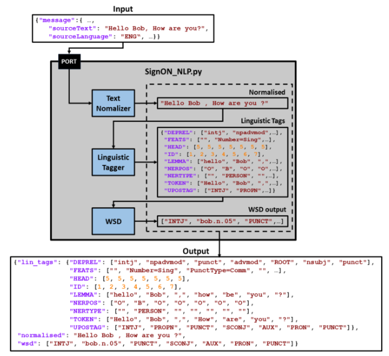

# WP3-Second-NLP-Pipeline

Implementation of the NLP pipeline presented in D3.6 "Second Natural Language Processing pipeline" and it is the output of task T3.5 “Implementing language-specific NLU pipelines” in work package WP3 “Source message recognition, analysis and understanding” of the SignON Project. The nlu pipeline is composed by the following modules:




**- TextNormizer.** This module normalise the input text, removes repetitive punctuations and applies spellchecking.

**- .**

**- WSD module.**

## Input-Outputs


Example of an input:
```
{
  "hello": "world" // This is a comment
}
```

Given the previous input, the pipeline outputs json:
```
{
  "hello": "world" // This is a comment
}
```

## Running the Server locally

```python
s = "Python syntax highlighting"
print s
```


## Testing the server
Once the API server is running, you can test it with the following code:

```python
s = "Python syntax highlighting"
print s
```


