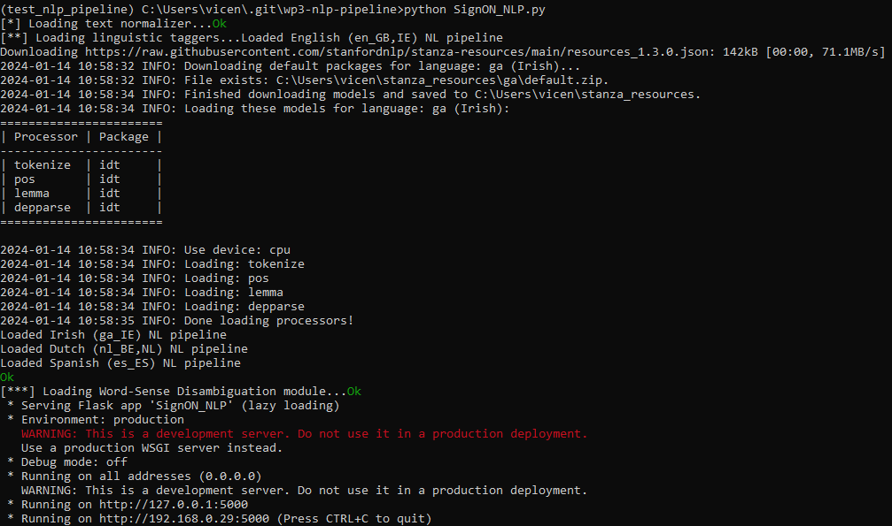

# WP3-Second-NLP-Pipeline

Implementation of the NLP pipeline presented in D3.6 "Second Natural Language Processing pipeline" and it is the output of task T3.5 “Implementing language-specific NLU pipelines” in work package WP3 “Source message recognition, analysis and understanding” of the SignON Project. The nlu pipeline is composed by the following modules:
<br>


<br>

**- TextNormizer.** This module normalise the input text, removes repetitive punctuations and applies spellchecking.

<br>

**- LinguisticTagger.** Annotates linguistic information on the input sentence. It includes part-of-speech, word dependency, name entity recognition and morphological information.

<br>

**- WSD module.** It performs word sense disambiguation on the input sentence using WordNet synsets. 

<br><br><br>

## Input-Outputs


Example of an input:
```
{
  "App": {
    "sourceURL": "NONE",
    "sourceText": "Hello Bob, How are you?",
    "sourceLanguage": "ENG",
    "sourceMode": "TEXT",
    "sourceFileFormat": "NONE",
    "sourceVideoCodec": "NONE",
    "sourceVideoResolution": "NONE",
    "sourceVideoFrameRate": -1,
    "sourceVideoPixelFormat": "NONE",
    "sourceAudioCodec": "NONE",
    "sourceAudioChannels": "NONE",
    "sourceAudioSampleRate": -1,
    "targetLanguage": "SPA",
    "targetMode": "AUDIO",
    "appInstanceID": "instance16",
    "T0App": "2021-11-16 11:22:12,450",
    "T1Orchestrator": "2021-11-16 11:22:12,550"
  }
}
```

Given the previous input, the pipeline outputs json:
```
{
  "lin_tags" :  {
                "DEPREL": ["intj", "npadvmod", "punct", "advmod", "ROOT", "nsubj", "punct"],
                "FEATS": ["", "Number=Sing", "PunctType=Comm", "", "Mood=Ind|Tense=Pres|VerbForm=Fin", "Case=Nom|Person=2|PronType=Prs", "PunctType=Peri"],
                "HEAD": [5, 5, 5, 5, 5, 5, 5],
                "ID": [1, 2, 3, 4, 5, 6, 7],
                "LEMMA": ["hello", "Bob", ",", "how", "be", "you", "?"],
                "NERPOS": ["O", "B", "O", "O", "O", "O", "O"],
                "NERTYPE": ["", "PERSON", "", "", "", "", ""],
                "TOKEN": ["Hello", "Bob", ",", "How", "are", "you", "?"],
                "UPOSTAG": ["INTJ", "PROPN", "PUNCT", "SCONJ", "AUX", "PRON", "PUNCT"]
                },
  "normalised": "Hello Bob , How are you ?",
  "wsd": ["INTJ", "bob.n.05", "PUNCT", "SCONJ", "AUX", "PRON", "PUNCT"]
}
```

## Running the Server locally

The first step is to install the package requeriments using the requirement.txt file and pip. This implementation runs well for python3.8; however, some issues were found when setting up the enviroment when using python3.12. Once the enviroment has been set up, you can run the server from the promtp:


```bash
python SingON_np.py
```

The next output informs that the server is running as expected:




## Testing the server
Once the API server is running, you can test it with the following code:

```python
s = "Python syntax highlighting"
print s
```
Output:

```python
s = "Python syntax highlighting"
print s
```


